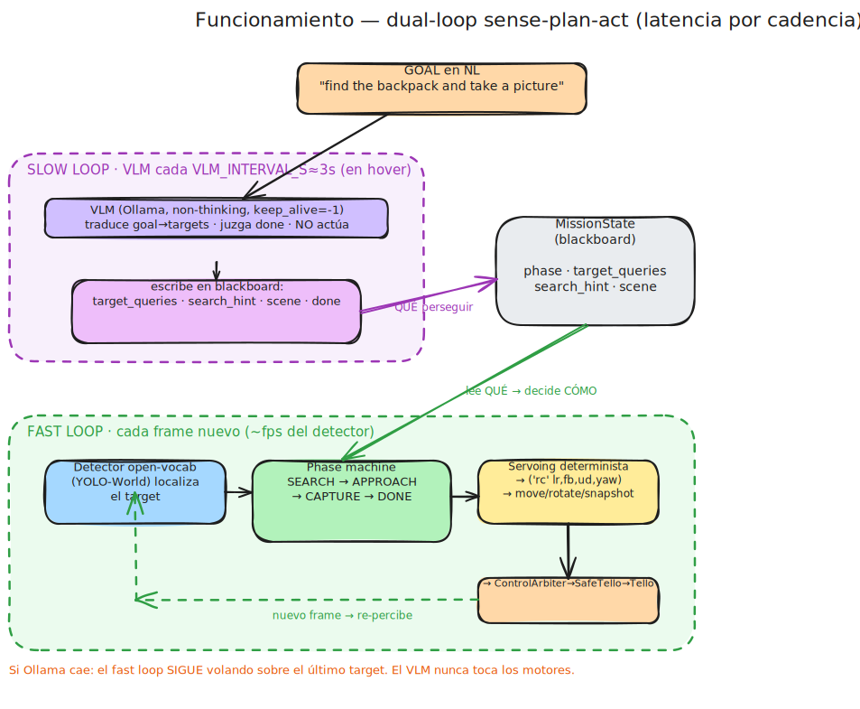
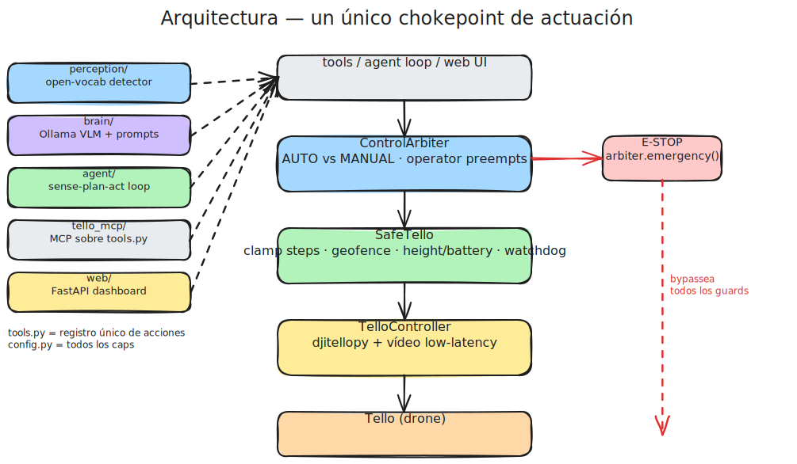

# Agentic Vision-Driven Tello Controller

An interactive agent that **sees what the Tello sees and flies it from natural-language
goals** — e.g. *"go towards the plant and take a picture."* It runs a continuous
**perceive → reason → act** loop until the goal is met, fully **local** on an NVIDIA
DGX Spark (and on an Apple-Silicon MacBook), controlling a **DJI/Robomaster Tello**.

```
goal: "find the backpack and take a picture"
   │
   ▼
 VLM plans ──▶ detector localizes ──▶ deterministic servoing flies ──▶ snapshot
 (slow loop)        (fast loop)              (fast loop)
```

> ⚠️ **This commands a real flying drone.** Bench-test props-off first, fly low and
> slow, and keep the **E-STOP** (`Esc`) within reach. See [Safety](#safety).

---

## How it works

<p align="center">
  
</p>

A single GPU means latency is governed by *cadence*, not by the number of models.
The system is split into **two decoupled loops**:

| Loop | Cadence | Runs | Job |
|------|---------|------|-----|
| **Fast** | every new frame | open-vocab detector + deterministic servoing | track the target, center & approach it — **no VLM** |
| **Slow** | every few seconds | VLM (Gemma 3 via Ollama) | turn the goal into detector targets, judge completion — **never actuates** |

The mission advances through a small phase machine — `SEARCH → APPROACH → CAPTURE →
DONE` — driven by the fast loop, while the VLM only re-plans while hovering. For a
**multi-step goal** the VLM first splits it into ordered sub-goals and the phase machine
runs once per step (see below).

---

## Writing goals

### Any object — not just COCO classes

The detector is **open-vocabulary** (YOLO-World): you can ask for *anything*, not only the
80 COCO classes. The brain turns your goal into short text queries the detector localizes.

The catch is *how well* it matches: common objects ("chair", "backpack", "potted plant")
match strongly; rare, abstract, or jargon terms do not, because the detector matches the
**visual appearance** of a concrete noun phrase — not acronyms or categories. So for complex
entities, **write a concrete visual noun**, ideally 1–3 words describing what the thing
*looks like*:

| Instead of… | Write… |
|-------------|--------|
| `UGV`, `ground robot` | `small tracked robot`, `small wheeled robot` |
| `gun` | `handgun`, `rifle` |
| `drone` | `small quadcopter` |
| `package` | `cardboard box` |

You can give a couple of phrasings at once (the brain may already do this) so the detector
gets more than one chance to match. For rare classes, the **larger** detector weights
generalize better — run with `DETECTOR_MODEL=yolov8x-worldv2.pt`.

### Multi-step goals

Goals can chain several objectives. The brain decomposes the goal into an **ordered list of
single-target steps** once at mission start, then the fast loop searches → approaches →
captures each in turn before moving to the next. This is fully general — any goal works, e.g.:

```
"find a bottle of water and afterwards a potted plant"
"go to the red box, then the blue box, then the green box"
"look for a backpack, then find a person"
```

A single-object goal stays one step and behaves exactly as before. Words like *then*, *after*,
*next*, *afterwards* mark sequential steps.

---

## Actuation chokepoint

Every command funnels through a single chain, so safety guards can't be bypassed
(except the explicit emergency cut):

<p align="center">
  
</p>

**Manual override is safety-grade:** any operator input preempts the agent to MANUAL;
re-arming AUTO is always explicit. Emergency stop bypasses every guard.

---

## Repository layout

| Path | What's in it |
|------|--------------|
| `agentic_tello/` | **Main package** — all source code lives here |
| `agentic_tello/tello_tools/` | Core control library: connection, low-latency video, **all safety guards** ([README](agentic_tello/tello_tools/README.md)) |
| `agentic_tello/perception/` | Open-vocab YOLO-World detector + its worker thread ([README](agentic_tello/perception/README.md)) |
| `agentic_tello/brain/` | Ollama VLM client + planning prompts ([README](agentic_tello/brain/README.md)) |
| `agentic_tello/agent/` | Dual-cadence sense-plan-act loop, mission state, servoing ([README](agentic_tello/agent/README.md)) |
| `agentic_tello/web/` | FastAPI dashboard: feed+overlay, decision log, goal box, manual control, E-STOP ([README](agentic_tello/web/README.md)) |
| `agentic_tello/photogrammetry/` | Offline 3D reconstruction via OpenDroneMap ([README](agentic_tello/photogrammetry/README.md)) |
| `agentic_tello/tools.py` | The single tool registry (one source of truth for every agent/MCP action) |
| `agentic_tello/config.py` | Every safety cap, cadence, and model name |
| `agentic_tello/main.py` | Single entrypoint — wires everything and serves the dashboard |
| `tello_mcp/` | Thin MCP server (separate process, HTTP proxy to `:8000`) — **not used by the in-process agent** ([README](tello_mcp/README.md)) |
| `bench_test.py` | Props-off validation of the whole stack — **run before any flight** |
| `docs/` | Architecture diagrams, network setup, cenital-view model docs |
| `snapshots/` | Runtime output (captures, BEV, 3D models) — gitignored except `.gitkeep` |

---

## REST API

The web server (`:8000`) exposes a REST surface for external integration (orchestrator,
`tello_mcp` proxy). Key endpoints:

| Endpoint | Method | Purpose |
|----------|--------|---------|
| `/mission` | `POST` | Start an autonomous mission (NL goal **or** marker survey) — returns 202 |
| `/mission/status` | `GET` | Poll mission progress (phase, photo availability) |
| `/mission/photo` | `GET` | Download the last snapshot captured by the mission |
| `/mission/done` | `POST` | Declare the current goal satisfied |
| `/control/takeoff` | `POST` | Take off |
| `/control/land` | `POST` | Land |
| `/control/move` | `POST` | Discrete move (`direction`, `cm`) |
| `/control/rotate` | `POST` | Rotate (`deg`) |
| `/control/mode` | `POST` | Switch `AUTO` / `MANUAL` |
| `/control/emergency` | `POST` | Emergency motor cut |
| `/control/snapshot` | `POST` | Save a snapshot |
| `/control/target` | `POST` | Set open-vocab detector queries |
| `/control/geofence` | `POST` | Enable / disable the geofence |
| `/telemetry` | `GET` | Battery, height, attitude |
| `/pose` | `GET` | Dead-reckoning position (x, y, heading) |
| `/status` | `GET` | Full HUD snapshot |

All control endpoints funnel through the single actuation thread — they never touch
djitellopy directly.

### Marker survey mode

`POST /mission` accepts a second mode for the UAV+UGV coordination use case: instead of a
natural-language `goal`, pass `{"markers": N}` (optionally with `marker_query` and
`survey_height_cm`). This triggers a **deterministic survey** that bypasses the VLM: the drone
climbs to the requested height and searches for `N` colour markers using **HSV segmentation**
(see [`perception/markers.py`](agentic_tello/perception/README.md#colour-marker-detection-markerspy))
instead of YOLO-World. The HSV path activates automatically when the query contains the
keyword `orange` (or `naranja`).

---

## Models (all local)

| Role | Model | Served by | Notes |
|------|-------|-----------|-------|
| **Brain (VLM)** | Gemma 3 12B | [Ollama](https://ollama.com) (OpenAI-compatible API) | kept warm (`keep_alive=-1`); called *sparingly* for planning only |
| **Detector** | open-vocab YOLO-World | [ultralytics](https://docs.ultralytics.com) | runs on the fast loop for localization |

Model names and the Ollama host are **env-overridable** — swap in newer models without
touching code:

```bash
VLM_MODEL=qwen3-vl:8b DETECTOR_MODEL=yolov8x-worldv2.pt uv run python -m agentic_tello
```

---

## Prerequisites

- **Python 3.12+**
- **[uv](https://docs.astral.sh/uv/)** for dependency management (never pip/poetry/conda directly)
- **[Ollama](https://ollama.com)** running locally with a vision model pulled:
  ```bash
  ollama pull gemma3:12b      # default; see config.py for alternatives
  ```
- A **Tello** drone, and your machine joined to its WiFi (`TELLO-XXXXXX`)

Intended to run on an **NVIDIA DGX Spark** (Linux, ARM64 + CUDA). Can be controlled
from any other machine via SSH port forwarding:
```bash
ssh -L 8000:localhost:8000 user@<spark-ip>
```

---

## Setup

```bash
git clone <repo-url> agentic-tello
cd agentic-tello
uv sync          # install everything from the lockfile
```

The detector weights download automatically on first run (ultralytics).

---

## Running

> **Sync once, with internet.** After cloning or changing dependencies, run `uv sync`
> on a normal connection to build the environment. When you're connected to the Tello's
> WiFi there is **no internet**, so plain `uv run` would fail trying to reach pypi to
> re-sync the project. For that reason the commands below (and the launch script) pass
> **`--no-sync`** — they use the already-built `.venv` and never touch the network.

### 1. Bench test first (props OFF)

```bash
uv run --no-sync python bench_test.py
```

Validates connection, telemetry, a live frame, that the agent is blocked while MANUAL,
and that the geofence rejects an out-of-bounds move — **without spinning the motors**.

### 2. Launch the full system

```bash
./launch_drone_agent.sh
```

This is the recommended path: it runs **pre-flight checks** (uv, Ollama + the VLM model,
Tello WiFi at `192.168.10.1`, Docker), **auto-starts `ollama serve`** if it's down,
brings up the **NodeODM** photogrammetry container idempotently (no name clash on
re-launch), and then starts the system. Useful flags:

```bash
./launch_drone_agent.sh --check    # run the pre-flight checks only, then exit
./launch_drone_agent.sh --no-odm   # skip NodeODM (no 3D reconstruction)
./launch_drone_agent.sh --yes      # don't stop on warnings (unattended)
```

To start it directly without the wrapper:

```bash
uv run --no-sync python -m agentic_tello
```

Then open **http://localhost:8000** (or `http://<host>:8000` from another machine — the
server binds `0.0.0.0`). Type a goal in the goal box, **Arm AUTO**, and the agent flies.
Manual keyboard control and **E-STOP** are always available.

### 3. Shut down

```bash
./stop_drone_agent.sh
```

Orderly shutdown, **drone first**: if the dashboard is up it commands a **safe landing**
via REST and waits for touchdown, then stops the agent + dashboard and the NodeODM
container. Ollama is **left running** by default (kept warm). Flags: `--no-land` (drone
already down), `--stop-ollama` (also stop the Ollama that launch started).

> If the dashboard process has already died, the script **cannot** land the drone (that
> process owns the link) — it will warn you to land manually.

### Web dashboard only (manual flight / detector check)

```bash
uv run --no-sync python -m agentic_tello.web.server
```

See the [web README](agentic_tello/web/README.md) for controls, the first-flight checklist, and the
WebSocket protocol.

---

## Configuration

All knobs live in [`config.py`](agentic_tello/config.py) — conservative **indoor-small-room defaults**.
Tune these to your actual room before flying:

| Setting | Default | Meaning |
|---------|---------|---------|
| `SPEED` | 40 cm/s | rc-control speed (manual + servoing) |
| `MAX_HEIGHT_CM` | 200 | refuse ascend above this |
| `GEOFENCE_RADIUS_CM` | 200 | dead-reckoning box radius from takeoff |
| `MIN_STEP_CM` / `MAX_STEP_CM` | 20 / 50 | discrete move bounds |
| `BATTERY_FLOOR_PCT` | 15 | auto-land at/below this |
| `WATCHDOG_S` | 2.0 | no fresh command within this ⇒ auto-hover |
| `VLM_INTERVAL_S` | 3.0 | min seconds between VLM (slow-loop) calls |

---

## Safety

- **Bench-test props-off** (`bench_test.py`) before any flight.
- First flights **low and slow**, with **E-STOP** (`Esc`) in reach.
- Low speed, small steps, height cap, dead-reckoning geofence, battery-floor auto-land,
  and a command watchdog (auto-hover on silence) are all enforced by `SafeTello`.
- Operator input always preempts the agent to MANUAL; re-arming AUTO is explicit.
- `arbiter.emergency()` cuts motors immediately, bypassing every guard.

> **Geofence toggle is narrow.** The dashboard's *Disable/Re-arm Geofence* button gates only
> the dead-reckoning radius check on the agent's **discrete `move()` steps** (search-reposition,
> a `move` maneuver, `return`). It is **not** what allows door-crossing in general: `rc`
> (continuous velocity) is never geofenced, so **manual WASD flight and the agent's APPROACH
> servoing can already leave the room** regardless of the toggle. Height/battery/watchdog caps
> stay enforced even with the geofence off — and there is still **no obstacle avoidance**.

---

## Development

Dependencies are managed with **uv**:

```bash
uv add <package>     # add a dependency
uv sync              # install from the lockfile
uv run python ...    # run within the project venv
```

### Linting & pre-commit

Linting uses **[Ruff](https://docs.astral.sh/ruff/)** (config in `pyproject.toml`).
Run it directly:

```bash
uv run ruff check .          # lint
uv run ruff check --fix .    # lint + autofix
```

A [pre-commit](https://pre-commit.com/) hook runs Ruff lint (plus basic file hygiene)
on every commit. Install it once:

```bash
uv run pre-commit install            # set up the git hook
uv run pre-commit run --all-files    # run against the whole repo on demand
```

> The Ruff **formatter** is intentionally *not* enforced — it conflicts with the
> project's deliberate compact one-line style. Run `uv run ruff format .` manually if
> you want it.
