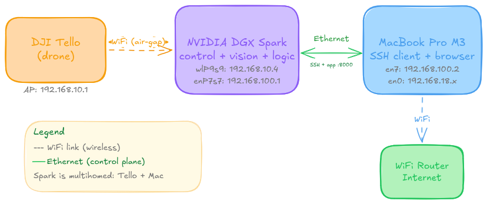
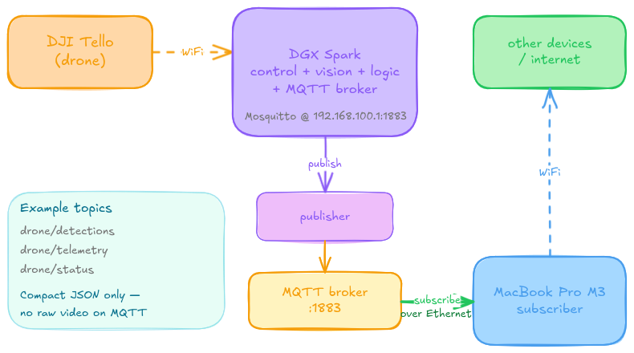

# Tello — Spark — Mac Network Setup

## Overview

The DJI Tello creates its own WiFi access point and forces any controller to join
that network. When the **DGX Spark** connects to the Tello, it loses its route to
the internet (the Tello is not a gateway). To keep working — and to control the
Spark headlessly — the Spark is made **multihomed**: it talks to the Tello over
WiFi while a direct **Ethernet** cable links it to the MacBook. The Mac keeps its
own internet over its WiFi. Control of the Spark (SSH) and the drone web app travel
over the Ethernet cable, so switching the Spark's WiFi to the Tello never drops the
session.

## Network topology



The Ethernet link is the **control plane** (SSH + web app). The Tello WiFi is the
**drone plane**. They are independent: changing one does not affect the other.

## Final state — IP map

| Device | Interface | IP address       | Role                                   |
|--------|-----------|------------------|----------------------------------------|
| Spark  | `enP7s7`  | `192.168.100.1`  | Ethernet to Mac (control plane)        |
| Spark  | `wlP9s9`  | `192.168.10.4`   | WiFi to Tello (drone plane)            |
| Mac    | `en7`     | `192.168.100.2`  | USB-C Ethernet adapter to Spark        |
| Mac    | `en0`     | `192.168.18.x`   | WiFi to home router (internet)         |
| Tello  | AP        | `192.168.10.1`   | Drone access point + SDK UDP `:8889`   |

> The Tello WiFi is in `192.168.10.0/24`, the Ethernet link in `192.168.100.0/24`,
> and the home WiFi in `192.168.18.0/24`. All three subnets are distinct, which is
> what keeps the routing unambiguous.

---

## Layer 1 — Ethernet link (Spark <-> Mac)

The Spark's RJ45 port (`enP7s7`) is pre-configured at `192.168.100.1`. Only the Mac
side needs a static IP. Set it **persistently** in macOS:

*System Settings -> Network -> (USB 10/100/1G/2.5G LAN) -> Details... -> TCP/IP*

- Configure IPv4: **Manually**
- IP address: `192.168.100.2`
- Subnet mask: `255.255.255.0`  (NOT `255.255.0.0` — that would overlap home WiFi)
- Router: **leave empty**  (so internet keeps routing over WiFi)

Verify from the Mac:

```bash
ipconfig getifaddr en7      # -> 192.168.100.2
ping -c 4 192.168.100.1     # 0% packet loss expected
```

If the ping fails despite correct IPs, check the Spark firewall:

```bash
# On the Spark
sudo ufw status
sudo ufw allow from 192.168.100.0/24   # only if ufw is active
```

## Layer 2 — SSH over Ethernet

From the Mac, open a terminal on the Spark through the cable:

```bash
ssh agullo@192.168.100.1
```

This session survives WiFi changes on the Spark, because it travels over Ethernet.
If SSH refuses the cection, enable the server on the Spark:

```bash
# On the Spark
sudo systemctl enable --now ssh
sudo systemctl status ssh
```

## Layer 3 — Tello WiFi (controlled via SSH)

The Spark's WiFi (`wlP9s9`) can only join one network at a time: either the Tello
or the home router. Switch it from inside the SSH session — the cable keeps you
connected.

```bash
# List nearby WiFi networks (find the Tello SSID, e.g. TELLO-CD01CF)
nmcli device wifi list

# Connect the Spark's WiFi to the Tello (open network, no password)
sudo nmcli device wifi connect "TELLO-CD01CF"

# Confirm the WiFi is now on the drone subnet (192.168.10.x)
ip addr show wlP9s9

# Reachability check to the drone
ping -c 3 192.168.10.1
```

Switch back to the home router when the Spark needs internet (apt, pip, git):

```bash
sudo nmcli connection up "HOME_WIFI_NAME"
```

> Note: `nmcli device wifi` needs `sudo`. If your Tello model uses a password:
> `sudo nmcli device wifi connect "TELLO-XXXXXX" password "PASSWORD"`.

## Accessing the drone web app

The app listens on `0.0.0.0:8000` on the Spark (all interfaces), so the Mac can
reach it two ways.

**Direct (simplest, over the cable):**

```
http://192.168.100.1:8000
```

**SSH port forward (portable):**

```bash
# On the Mac, in a separate terminal
ssh -L 8000:localhost:8000 agullo@192.168.100.1
# then open in the Mac browser:
# http://localhost:8000
```

If the direct method does not load, open the port on the Spark firewall:

```bash
# On the Spark
sudo ufw allow from 192.168.100.0/24 to any port 8000
```

---

## MQTT (TODO)

Planned logical data flow once the physical setup above is in place. The Spark runs
the control, vision, and decision logic locally, then publishes high-level messages
(not raw video) that the Mac consumes to drive other devices.



Open items to fill in later:

- Install and run a broker (e.g. Mosquitto) on the Spark, listening on
  `192.168.100.1:1883`.
- Spark publishes processed results over the Ethernet link.
- Mac subscribes as a client at `192.168.100.1:1883`.
- Keep continuous video off MQTT; send only compact JSON messages and add new
  topics (`drone/telemetry`, `drone/detections`, ...) as needed.
